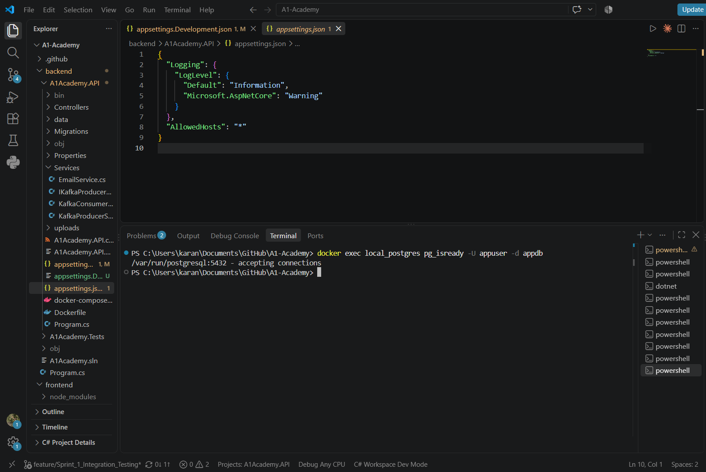
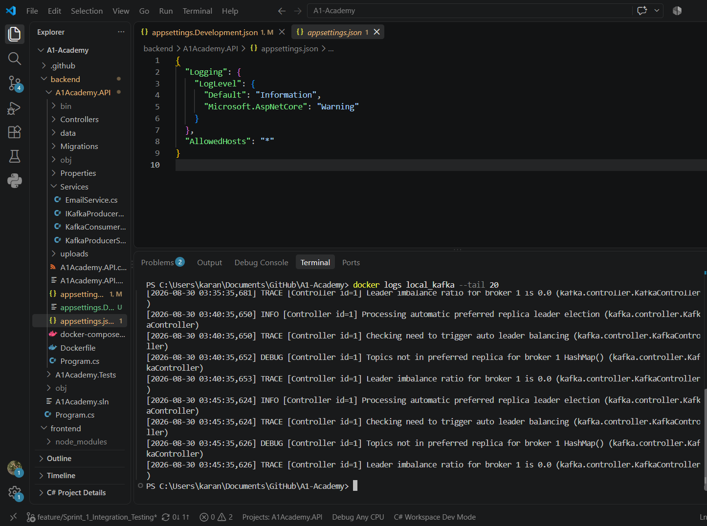
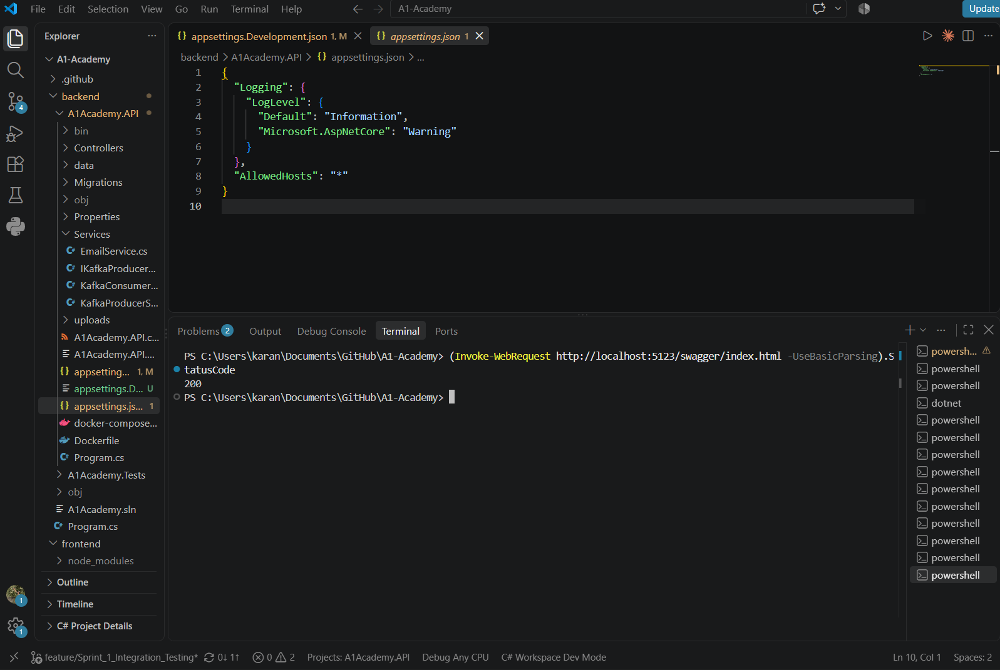

# A1 Academy - Online Learning & Tutoring Platform

Welcome to the A1 Academy project repository!

## Project Structure
- `/frontend`: React.js (Vite) application
- `/backend/A1Academy.API`: ASP.NET Core 10 Web API (Configured for PostgreSQL & Kafka)
- `/backend/A1Academy.Tests`: xUnit automated tests
- `/.github/workflows`: GitHub Actions CI/CD pipelines (Azure deployment & automated tests)

## Local Setup Instructions

### Prerequisites
- **Node.js** (v20+ recommended) for the frontend.
- **.NET 10 SDK** for the backend API and testing.
- **Docker Desktop** (Optional, but recommended for spinning up PostgreSQL and Kafka easily).

### Development Configuration

The backend requires configuration through `appsettings.Development.json`. This file is excluded from version control for security reasons.

1. Copy the template file to create your local development settings:
```bash
cd backend/A1Academy.API
cp appsettings.Development.json.template appsettings.Development.json
```

2. Update the placeholders in `appsettings.Development.json` with your actual credentials:
   - `<YOUR_DB_PASSWORD>` - Database password (from docker-compose.yml)
   - `<YOUR_JWT_SECRET_KEY>` - A secure random key for JWT authentication
   - `<YOUR_GOOGLE_CLIENT_ID>` - Your Google OAuth client ID
   - `<YOUR_SENDER_EMAIL>` - Email address for SMTP
   - `<YOUR_SMTP_PASSWORD>` - SMTP password (e.g., Gmail app password)
   - `<YOUR_APPLICATION_INSIGHTS_CONNECTION_STRING>` - Application Insights key (optional)

**⚠️ Important:** Never commit `appsettings.Development.json` with real credentials to version control.

### 1. Database & Infrastructure (Docker)
If you have Docker installed, you can spin up the required PostgreSQL database and Kafka instance automatically:
```bash
docker-compose up -d
```

### 2. Backend (ASP.NET Core 10)
1. Navigate to the API directory: `cd backend/A1Academy.API`
2. Install dependencies/restore: `dotnet restore`
3. Run the backend server: `dotnet run`

### 3. Frontend (React + Vite)
1. Open a new terminal and navigate to the frontend: `cd frontend`
2. Install Node dependencies: `npm install`
3. Start the Vite development server: `npm run dev`

## Local Infrastructure Setup & Verification

The A1 Academy backend uses Docker Compose to run the required local infrastructure services.

### Services

| Service | Image | Port | Purpose |
|---|---|---:|---|
| PostgreSQL | postgres:16-alpine | 5432 | Application database |
| ZooKeeper | confluentinc/cp-zookeeper:7.5.0 | 2181 | Kafka coordination |
| Kafka | confluentinc/cp-kafka:7.5.0 | 9092 | Event streaming & messaging |

### Starting Infrastructure

Start all services with:

```powershell
docker compose up -d
```

Verify services are running:

```powershell
docker compose ps
```

### PostgreSQL Verification

Verify PostgreSQL connectivity:

```powershell
docker exec local_postgres pg_isready -U appuser -d appdb
```

Expected output:
```
/var/run/postgresql:5432 - accepting connections
```

### Kafka Verification

Verify Kafka is healthy by checking container logs:

```powershell
docker logs local_kafka --tail 20
```

The backend will output on startup:
```
SUCCESS: Kafka Consumer connected & listening!
```

### Backend Database Connection

The ASP.NET Core backend uses the connection string configured in `appsettings.Development.json`:

```
Host=localhost
Port=5432
Database=appdb
Username=appuser
```

On successful startup, you should see:
```
SUCCESS: Backend connected to PostgreSQL
```

### API & Swagger Verification

Once the backend is running on `http://localhost:5123`, verify the API is accessible:

```powershell
(Invoke-WebRequest http://localhost:5123/swagger/index.html -UseBasicParsing).StatusCode
```

Expected output: `200`

Visit [http://localhost:5123/swagger/index.html](http://localhost:5123/swagger/index.html) in your browser to explore the API.

## Automated Testing
To run the unit tests locally, navigate to the tests folder and execute them:
```bash
cd backend/A1Academy.Tests
dotnet test
```

## Evidence

The following screenshots provide evidence that the local infrastructure and backend integration were successfully verified.

### Docker Compose Services

PostgreSQL, Kafka, and ZooKeeper were successfully started using Docker Compose.


### PostgreSQL

Backend connectivity to PostgreSQL was successfully verified.



### Kafka

Kafka consumer successfully connected and listened for messages.



### Backend

The backend successfully connected to the required infrastructure services.


### Swagger API

Swagger was successfully served by the ASP.NET Core backend with HTTP 200.



### Integration Testing

The automated integration test suite was executed successfully.


Test result:

- **Total:** 12
- **Passed:** 12
- **Failed:** 0
- **Skipped:** 0
- **Build:** Successful