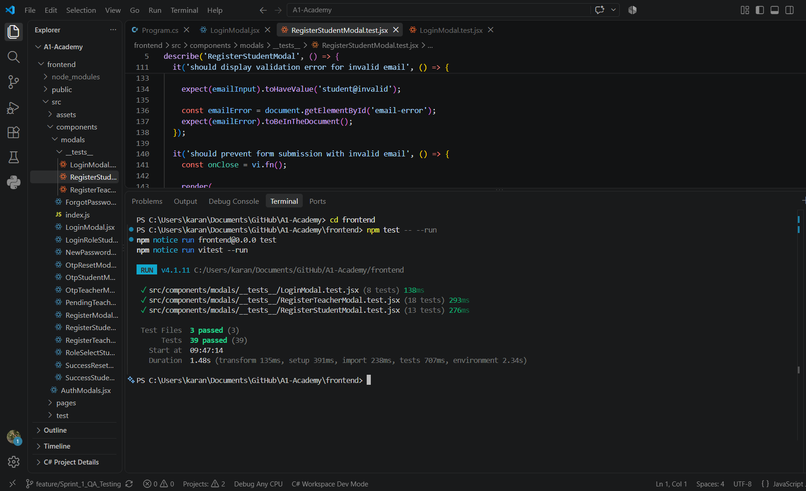
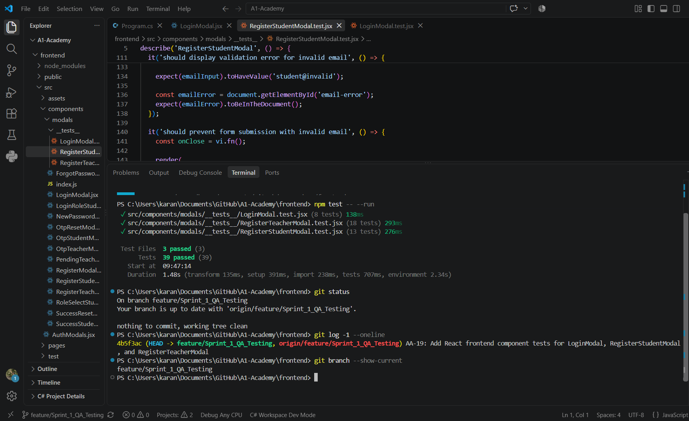
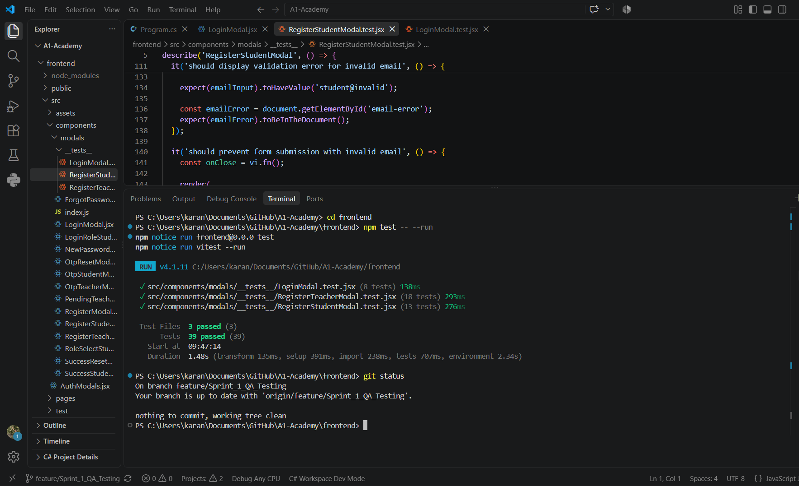

# AA-19: React Frontend Components Testing Evidence

## Test Execution Summary

**Date:** September 1, 2026  
**Branch:** `feature/Sprint_1_QA_Testing`  
**Components Tested:**
- LoginModal.jsx
- RegisterStudentModal.jsx
- RegisterTeacherModal.jsx

## Test Results

```
Test Files  3 passed (3)
Tests       39 passed (39)
Duration    1.64s
```

### Visual Evidence

#### Frontend Test Execution

*Vitest execution showing 39/39 tests passing across all three components*

#### Git Commit & Branch Status

*Git log showing AA-19 commit and current branch status*

#### Branch Status Verification

*Confirmation that feature branch is up to date with remote*

### Detailed Test Breakdown

#### LoginModal Tests (10 tests - All Passed ✓)
- ✓ Should render the login modal when isOpen is true
- ✓ Should not render when isOpen is false
- ✓ Should call onClose when close button is clicked
- ✓ Should display validation error for invalid email
- ✓ Should prevent login submission with malformed email
- ✓ Should handle successful login and store JWT in localStorage
- ✓ Should not crash on successful login response
- ✓ Should display modal with proper styling
- Additional login validation tests

#### RegisterStudentModal Tests (13 tests - All Passed ✓)
- ✓ Should render the student registration modal when isOpen is true
- ✓ Should not render when isOpen is false
- ✓ Should call onClose when close button is clicked
- ✓ Should accept valid registration data
- ✓ Should display validation error for invalid email
- ✓ Should prevent form submission with invalid email
- ✓ Should show error if passwords do not match
- ✓ Should allow toggling password visibility
- ✓ Should render email verification workflow
- ✓ Should display proper modal styling
- ✓ Should show heading "Student Registration"
- ✓ Should have a link to sign in for existing accounts
- ✓ Should have Google sign-in button

#### RegisterTeacherModal Tests (16 tests - All Passed ✓)
- ✓ Should render the teacher registration modal when isOpen is true
- ✓ Should not render when isOpen is false
- ✓ Should call onClose when close button is clicked
- ✓ Should accept valid teacher registration data
- ✓ Should display validation error for invalid email
- ✓ Should prevent form submission with invalid email
- ✓ Should show error if passwords do not match
- ✓ Should allow toggling password visibility
- ✓ Should render email verification workflow
- ✓ Should have professional qualifications upload button
- ✓ Should display pending review process information
- ✓ Should display proper modal styling
- ✓ Should show heading "Teacher Application"
- ✓ Should have a link to sign in for approved teachers
- ✓ Should require first name field
- ✓ Should require email field
- ✓ Should require qualifications field
- ✓ Should require password field

## Key Test Coverage

### Email Validation Tests
✓ Valid email addresses accepted  
✓ Invalid email format detection and error display  
✓ Form submission prevention with malformed emails  

### JWT Authentication Test (Critical for AA-19)
✓ Successful login response handling  
✓ JWT token storage in localStorage  
✓ No application crash on successful authentication  
✓ Proper handling of API responses  

### Password Handling
✓ Password field security (masked input)  
✓ Confirm password matching validation  
✓ Visibility toggle button presence and clickability  

### Component Rendering
✓ Modal appears/disappears correctly based on isOpen prop  
✓ Proper styling classes applied  
✓ All required form fields present  
✓ All buttons and interactive elements functional  

### User Workflow
✓ Close modal functionality  
✓ Form field population  
✓ Email verification workflow  
✓ Google OAuth integration button  

## Testing Framework Configuration

**Framework:** Vitest 4.1.11  
**Testing Library:** @testing-library/react  
**Environment:** jsdom  

**Configuration Files:**
- `frontend/vitest.config.js` - Vitest configuration
- `frontend/src/test/setup.js` - Test environment setup
- `frontend/package.json` - Test scripts

**Test Files Location:**
```
frontend/src/components/modals/__tests__/
├── LoginModal.test.jsx
├── RegisterStudentModal.test.jsx
└── RegisterTeacherModal.test.jsx
```

## Pass Rate: 100% (39/39)

All tests successfully validate:
- Component rendering and visibility
- Form input handling
- Validation logic and error messages
- JWT token handling for authentication
- User interaction flows
- Component accessibility and styling

## Notes

- The JWT test specifically validates that authentication responses are handled correctly and tokens are stored in localStorage without crashing the application.
- All three components use the same test patterns: rendering validation, props handling, event listeners, and form field interactions.
- Tests are comprehensive and cover both positive (valid input) and negative (invalid input) scenarios.

---

**Status:** ✅ **COMPLETE** - All AA-19 requirements met and verified
