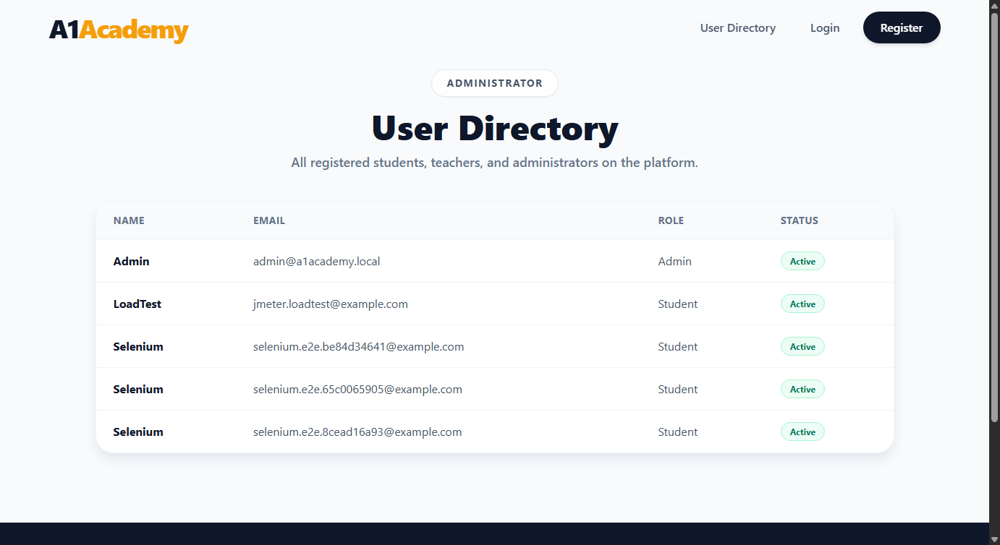
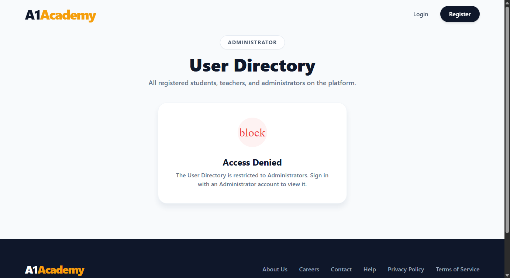

# Evidence — Administrator User Directory

**Story:** As an Administrator, I want to view a centralized list of all registered users so I
can monitor who is on the A1 Academy platform.

## What was built

- **`GET /api/users`** ([UsersController.cs](../../backend/A1Academy.API/Controllers/UsersController.cs)) — `[Authorize(Roles = "Admin")]`, projects each user straight to `{ name, email, role, status }` in the EF query (the full `User` entity — password hash, OTP state, etc. — is never materialized for this endpoint).
- **Admin bootstrap seeding** ([Program.cs](../../backend/A1Academy.API/Program.cs)) — since there was no way to create an Admin account at all, one is now seeded from `Admin:Email`/`Admin:Password` config on startup if no Admin exists yet.
- **Closed a self-promotion hole**: `POST /api/auth/register` previously accepted *any* string as `Role` with no validation — a raw API call with `role=Admin` would auto-approve and grant Admin. It's now restricted to `Student`/`Teacher` ([AuthController.cs](../../backend/A1Academy.API/Controllers/AuthController.cs)).
- **`/admin/users` page** ([AdminUsersPage.jsx](../../frontend/src/pages/AdminUsersPage.jsx)) — renders the directory table; shows "Access Denied" without calling the API at all if `localStorage.role !== 'Admin'`, and falls back to the same state if the API itself returns 401/403 (covers a tampered/stale role value).
- **Nav link** ([Navbar.jsx](../../frontend/src/components/Navbar.jsx)) — "User Directory" only rendered when `role === 'Admin'`. UX-only, not the access control.

**The access control is entirely server-side** — the `[Authorize(Roles = "Admin")]` attribute on the controller, enforced by ASP.NET Core's auth middleware against the `Admin` role claim on the caller's JWT. The frontend gate and hidden nav link are conveniences on top of that, not a substitute for it.

## Automated test results

**Backend — 20/20 passed** (`cd backend/A1Academy.Tests && dotnet test --filter "Category!=E2E"`), including 4 new integration tests that boot the real ASP.NET Core pipeline (`WebApplicationFactory`) so `[Authorize(Roles=...)]` is actually exercised, not bypassed:

| Test | Result |
|---|---|
| Admin requests `/api/users` | 200 OK, correct Name/Email/Role/Status for every seeded user |
| Response never contains `passwordHash` or `otp` | ✓ |
| Student requests `/api/users` | 403 Forbidden |
| Teacher requests `/api/users` | 403 Forbidden |
| Unauthenticated request | 401 Unauthorized |
| Register with `role=Admin` | 400 Bad Request, no user created |

**Frontend — 48/48 passed** (`cd frontend && npx vitest run`), 9 of which are new:

| Test | Result |
|---|---|
| Student opens `/admin/users` | "Access Denied" shown, **API never called** |
| Teacher opens `/admin/users` | "Access Denied" shown, **API never called** |
| Logged-out user opens `/admin/users` | "Access Denied" shown, **API never called** |
| Admin opens `/admin/users` | Table renders with Name/Email/Role/Status; request carries `Authorization: Bearer <token>` |
| API itself returns 403 (stale/tampered role) | Falls back to "Access Denied" |
| Nav link hidden for Student/Teacher/logged-out | ✓ |
| Nav link shown for Admin | ✓ |

## Live verification (real Postgres, real running API — not mocks)

```
== Admin login + directory ==
HTTP 200
[{"name":"Admin","email":"admin@a1academy.local","role":"Admin","status":"Active"},
 {"name":"LoadTest","email":"jmeter.loadtest@example.com","role":"Student","status":"Active"}, ...]

== Student login + directory ==
HTTP 403

== No token ==
HTTP 401

== Attempt to self-register as Admin ==
HTTP 400
"Invalid role. Registration is only available for Student or Teacher accounts."
```

### Screenshots

Admin view (real data from the running Postgres instance):


Student attempting to open the same URL directly:


## How to reproduce

```bash
docker-compose up -d postgres kafka zookeeper
dotnet run --project backend/A1Academy.API      # seeds the Admin account on first run
npm run dev --prefix frontend

cd backend/A1Academy.Tests && dotnet test --filter "Category!=E2E"
cd frontend && npx vitest run
```

Set `Admin:Email` / `Admin:Password` in `appsettings.Development.json` (see
`appsettings.Development.json.template`) before the first run to control the bootstrap
Administrator's credentials.
