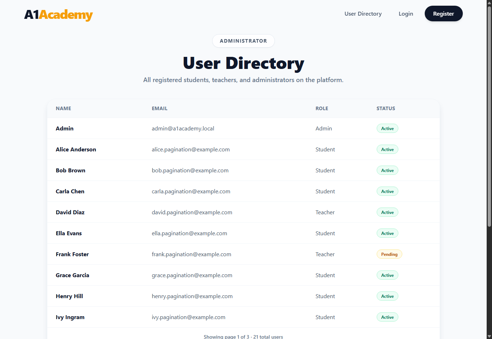
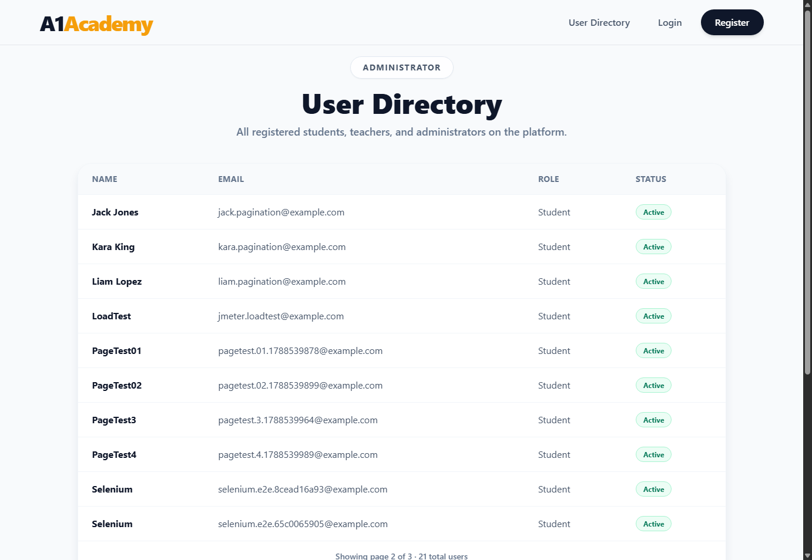

# Evidence — User Directory Pagination

**Story:** As an Administrator, I want to navigate the user directory using pagination so the
interface stays fast and readable even with hundreds of users.

## What changed

- **`GET /api/users`** now accepts `?page=` and `?pageSize=` (defaults `1`/`10`, clamped to
  `1..100`) and returns `{ items, page, pageSize, totalCount, totalPages }` instead of a flat
  array ([UsersController.cs](../../backend/A1Academy.API/Controllers/UsersController.cs)).
  Out-of-range input (`page=0`, `pageSize=99999`) clamps to sensible bounds rather than erroring.
- **[Pagination.jsx](../../frontend/src/components/Pagination.jsx)** — a reusable Previous/Next
  + windowed page-number control (current page ± 2, with `1`, the last page, and `…` for the
  gaps), so it stays readable at any page count. Renders nothing when everything fits on one page.
- **[AdminUsersPage.jsx](../../frontend/src/pages/AdminUsersPage.jsx)** drives `Pagination` off
  the API's `page`/`totalPages`, refetching whenever the page changes.

## Automated test results

**Backend — 22/22 passed**, 2 new: multi-page correctness (13 seeded users, `pageSize=5` → 3
pages, no overlap between pages, empty result past the last page) and input clamping.

**Frontend — 57/57 passed**, 9 new across `Pagination.test.jsx` (Previous/Next disabled state,
click behavior, ellipsis collapsing for large page counts) and `AdminUsersPage.test.jsx`
(pagination hidden on a single page, page-number/Next-click triggers a refetch of the right page).

## Live verification (real Postgres, 21 real users, real running app)

```
GET /api/users?page=1&pageSize=10  ->  10 items, page 1, totalPages 3, totalCount 21
GET /api/users?page=2&pageSize=10  ->  10 items, page 2, totalPages 3, totalCount 21
```

Screenshots below are from an actual Brave session driven by Selenium: navigated to
`/admin/users`, then **clicked the real "Next" button** (not just changed the URL) and waited
for the page-2 content to render.

Page 1:


Page 2, after clicking Next:


## How to reproduce

```bash
docker-compose up -d postgres kafka zookeeper
dotnet run --project backend/A1Academy.API
npm run dev --prefix frontend

cd backend/A1Academy.Tests && dotnet test --filter "Category!=E2E"
cd frontend && npx vitest run
```
