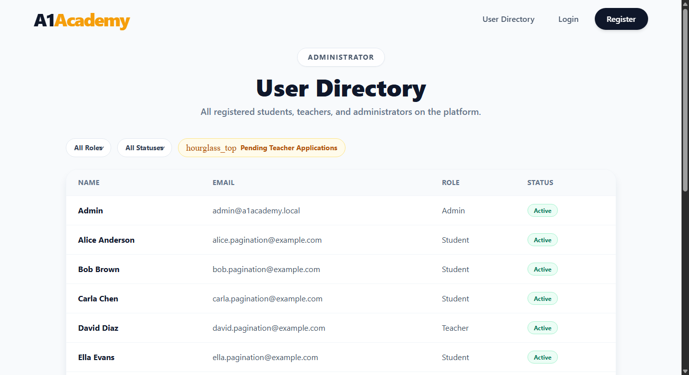
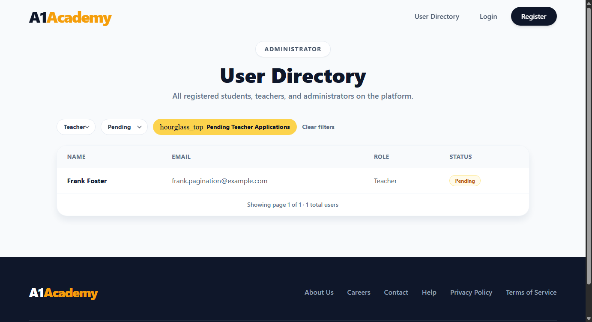

# Evidence — Filter Pending Teachers

**Story:** As an Administrator, I want to easily identify Teachers awaiting approval so I can
review their applications efficiently.

## What changed

- **`GET /api/users`** now accepts `?role=` and `?status=` query params, applied as `WHERE`
  clauses before pagination ([UsersController.cs](../../backend/A1Academy.API/Controllers/UsersController.cs)).
  `status=Pending`/`status=Active` map to the same `Role == "Teacher" && !IsApproved` rule the
  response's `Status` field is derived from - unrecognized/empty values are treated as no filter.
- **[UserFilters.jsx](../../frontend/src/components/UserFilters.jsx)** — Role and Status
  dropdowns, plus a one-click **"Pending Teacher Applications"** button that sets `role=Teacher`
  and `status=Pending` together (the exact scenario in the acceptance criterion), and a "Clear
  filters" link that appears once any filter is active.
- **[AdminUsersPage.jsx](../../frontend/src/pages/AdminUsersPage.jsx)** — filters reset the page
  to 1 (a stale page number from an unfiltered view could point past the end of a filtered set)
  and are included in the API request; empty results are labeled "No users match the current
  filter." instead of the generic empty-directory message.

## Automated test results

**Backend — 25/25 passed**, 3 new: the exact role=Teacher+status=Pending scenario (isolates
pending teachers from approved teachers/students/admins), role-only filtering (includes both
approved and pending teachers), and status=Active (excludes pending teachers).

**Frontend — 67/67 passed**, 10 new across `UserFilters.test.jsx` (dropdown/button callbacks,
`aria-pressed` state, Clear-filters visibility) and `AdminUsersPage.test.jsx` (the quick-filter
button requests `role=Teacher&status=Pending` and resets to page 1, dropdown selections refetch
with the right query params, Clear filters refetches unfiltered).

## Live verification (real Postgres, real running app)

```
GET /api/users?role=Teacher&status=Pending
-> {"items":[{"name":"Frank Foster","email":"frank.pagination@example.com","role":"Teacher","status":"Pending"}],"totalCount":1,...}

GET /api/users?role=Teacher          -> both the approved and the pending teacher
GET /api/users?status=Active         -> everyone except the pending teacher
```

Unfiltered directory:


After clicking "Pending Teacher Applications" in a real browser session:


## How to reproduce

```bash
docker-compose up -d postgres kafka zookeeper
dotnet run --project backend/A1Academy.API
npm run dev --prefix frontend

cd backend/A1Academy.Tests && dotnet test --filter "Category!=E2E"
cd frontend && npx vitest run
```
