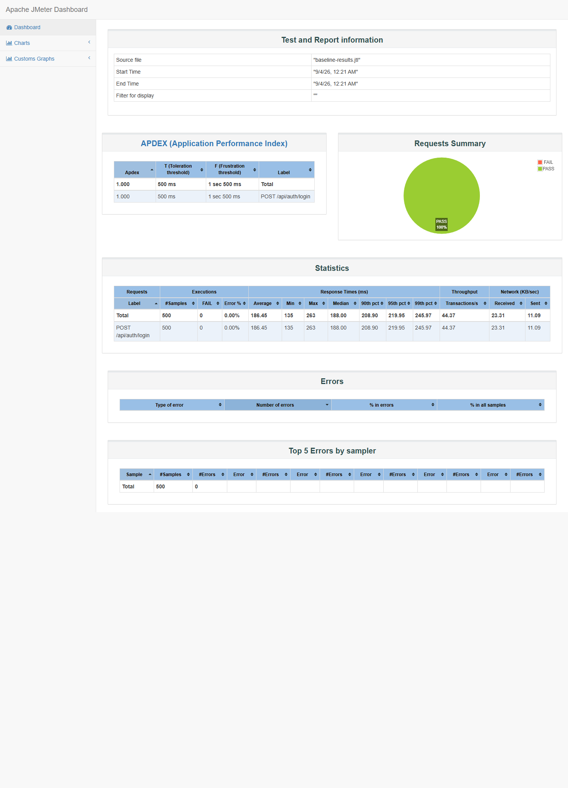
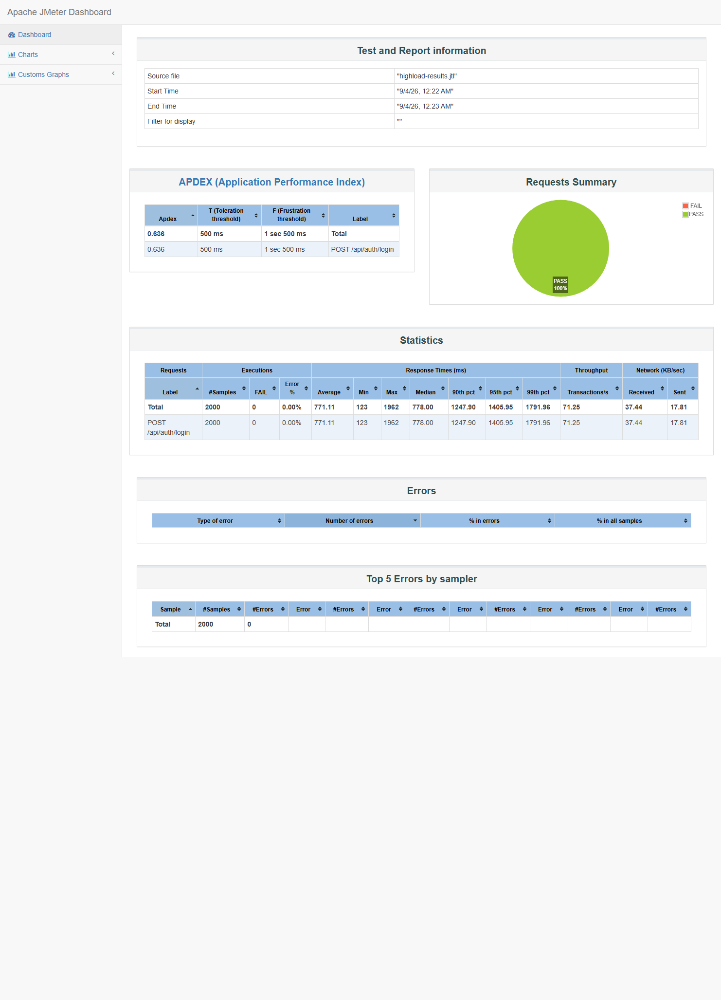

# Load Testing Evidence — Login Endpoint Performance

**Target:** `POST /api/auth/login` (ASP.NET Core API, `http://localhost:5123`)
**Tool:** Apache JMeter 5.6.3, non-GUI mode
**Test plan:** [`performance/jmeter/login-load-test.jmx`](../../performance/jmeter/login-load-test.jmx)
**Success criterion:** sub-5-second response time under expected load

Apache JMeter 5.6.3 executed three profiles against a live local instance of the API (Postgres +
Kafka via `docker-compose`, API via `dotnet run`), each against the same seeded Student account
(`seed-load-test-user.sh`). The dashboard screenshots below are captures from those runs.

**Verification status:** Implementation complete and live execution verified locally with JMeter
and the A1 Academy backend/database stack running.

## Results

| Profile | Users | Requests | Errors | Avg (ms) | Median (ms) | 90th (ms) | 95th (ms) | 99th (ms) | Max (ms) | Throughput (req/s) |
|---|---:|---:|---:|---:|---:|---:|---:|---:|---:|---:|
| Baseline | 50 | 500 | 0 (0.00%) | 186 | 188 | 209 | 220 | 246 | 263 | 44.4 |
| Stress | 100 | 1,000 | 0 (0.00%) | 141 | 139 | 147 | 159 | 181 | 193 | 62.3 |
| Higher load | 200 | 2,000 | 0 (0.00%) | 771 | 778 | 1,248 | 1,406 | 1,792 | 1,962 | 71.3 |

**Result: PASS at every profile tested.** Even at 200 concurrent users (2,000 requests), the
worst individual response was 1.96s — well under the 5,000ms threshold — with zero failed
logins across all 3,500 requests sent.

### Dashboard screenshots

Baseline (50 users):


Higher load (200 users):


## Observations

- **No functional failures at any concurrency level tested.** Every request that returned HTTP
  200 also carried a valid JWT (checked via response assertion, not just status code).
- **Response time is not flat under concurrency.** Average latency roughly quadrupled from 50 to
  200 concurrent users (186ms → 771ms). `AuthController.Login` calls `BCrypt.Net.BCrypt.Verify`
  synchronously, which is deliberately CPU-expensive (that's what makes password hashing safe) —
  at higher concurrency, requests start queuing for CPU/thread-pool time. It never came close to
  breaching the 5s SLA in this test, but it's the mechanism to watch if load grows further.
- **The 100-user "stress" run showed lower latency than the 50-user baseline.** Most likely JIT
  warm-up and connection-pool priming from the preceding run rather than a real regression in
  headroom — re-running profiles in a cold environment would give a cleaner apples-to-apples
  comparison than back-to-back runs on a warmed-up process.

## How to reproduce

```bash
docker-compose up -d postgres kafka zookeeper
dotnet run --project backend/A1Academy.API

cd performance/jmeter
./seed-load-test-user.sh
jmeter -n -t login-load-test.jmx -l results.jtl -Jusers=50  -JrampUp=10 -Jloops=10   # baseline
jmeter -n -t login-load-test.jmx -l results.jtl -Jusers=100 -JrampUp=15 -Jloops=10   # stress
jmeter -n -t login-load-test.jmx -l results.jtl -Jusers=200 -JrampUp=20 -Jloops=10   # higher load
jmeter -g results.jtl -o report/
```

See [`performance/jmeter/README.md`](../../performance/jmeter/README.md) for full details.
