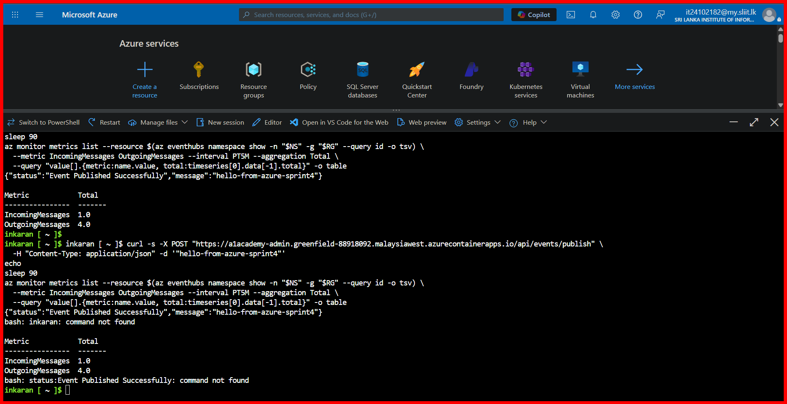

# Sprint 4: Kafka Integration (Local + Azure Event Hubs) Evidence

## Summary

**Date:** October 1, 2026  
**Role:** DevOps  
**Pull request:** #50 (`devops/sprint4-kafka`, merge commit `7fc5884`)

All four backend services (Auth, Admin, Teacher, Student) are connected to Kafka, both in the
local docker-compose environment and in production on Azure, where the broker is an Azure Event
Hubs namespace accessed through its Kafka endpoint.

| Environment | Broker | Address used by the services |
|---|---|---|
| Local (docker-compose) | `confluentinc/cp-kafka:7.5.0` | `kafka:29092` (containers), `localhost:9092` (host) |
| Azure | Event Hubs Standard, `a1academy-kafka-sprint4` in `A1-Academy-RG` | `a1academy-kafka-sprint4.servicebus.windows.net:9093` (SASL_SSL) |

Each service consumes in its own consumer group (`A1Academy.AuthService`, `A1Academy.AdminService`,
...), so every service receives every event.

## Azure Setup

1. Created the Event Hubs namespace (Standard tier, Kafka enabled) and the `test-topic` event hub
   (2 partitions). Event Hubs does not auto-create topics, so each new topic must be created explicitly.
2. Created a `Send` + `Listen` only authorization rule (`a1academy-services`) for the services.
3. Stored its connection string as a Container App secret (`kafka-sasl-password`) on all four apps
   and referenced it with `secretref:`, so it is not visible in plain text.
4. Updated all four Container Apps to image tag `7fc5884da6d8fd4cd297ce8dac4291bb685da735` with
   the `Kafka__*` environment variables.

## Verification Results

| Check | Result |
|---|---|
| Active revisions (auth, admin, teacher, student) | 4/4 `Healthy`, `Running` |
| Event Hubs `ActiveConnections` | 8 (a producer and a consumer per service) |
| `POST /api/events/publish` on the Admin service | `Event Published Successfully` |
| Event Hubs `IncomingMessages` / `OutgoingMessages` | 1 in / 4 out: one copy delivered to each service |

### End-to-End Test in Azure

*One message published through the Admin service: Event Hubs records 1 incoming and 4 outgoing
messages, one per service's consumer group. (The second run and the `command not found` lines are
from an accidental re-paste that included the shell prompt; they are harmless.)*

### Local Test (docker-compose)

```powershell
docker compose up -d --build
docker exec -it local_kafka bash -c "echo hello-sprint4 | kafka-console-producer --bootstrap-server localhost:29092 --topic test-topic"
docker compose logs auth admin teacher student | Select-String "KAFKA RECEIVED"
```

```
local_student  |       [KAFKA RECEIVED]: hello-sprint4
local_auth     |       [KAFKA RECEIVED]: hello-sprint4
local_admin    |       [KAFKA RECEIVED]: hello-sprint4
local_teacher  |       [KAFKA RECEIVED]: hello-sprint4
```

## Known Follow-ups

- `POST /api/events/publish` has no authentication and is reachable on the Admin app's public
  address. It should be restricted to Admins or removed once real domain events replace `test-topic`.
- CI pushes images to Docker Hub but does not deploy them; the Container Apps had to be moved to
  the new image tag manually.
