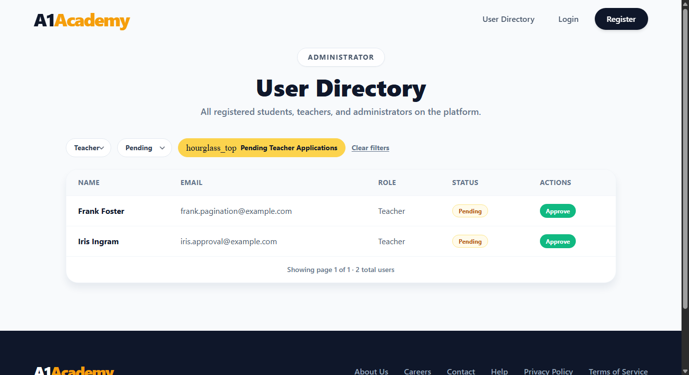
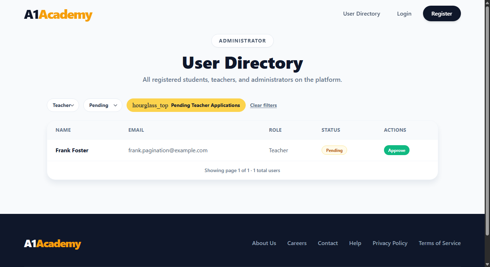

# Evidence — Teacher Approval

**Story:** As an Administrator, I want to approve a Pending Teacher's account so that the
verified educator can begin scheduling and managing classes.

## What changed

- **`PATCH /api/users/{id}/approve`** ([UsersController.cs](../../backend/A1Academy.API/Controllers/UsersController.cs))
  flips `IsApproved` to `true` on a Teacher account. Guarded the same way `GET /api/users` is -
  `[Authorize(Roles = "Admin")]` on the controller covers this action too, so only an Admin JWT
  can call it. Returns 404 for an unknown id, 400 if the target isn't a Teacher (approval doesn't
  mean anything for Students/Admins), and is idempotent - approving an already-approved teacher
  just returns 200 with no extra writes instead of erroring.
- **`UserSummary`** now includes `Id` - needed so the frontend has something to send back on
  approve. Nothing else about the directory response shape changed.
- **[AdminUsersPage.jsx](../../frontend/src/pages/AdminUsersPage.jsx)** — added an Actions column
  with an "Approve" button on any row whose Status is Pending. Clicking it calls the approve
  endpoint and updates that row in place: if the admin is on the "Pending Teacher Applications"
  filter the row disappears (it no longer matches `status=Pending`), otherwise the badge just
  flips to Active. A failed request shows an inline error banner and re-enables the button so
  the admin can retry.

This closes the loop that "Filter Pending Teachers" opened - filtering finds them, this ticket
lets an admin actually act on what it found.

## Automated test results

**Backend — 31/31 passed**, 6 new: approving a pending teacher flips it to Active (checked both
in the approve response and by re-querying the directory), approving an already-approved teacher
is a no-op that still returns 200, approving a Student returns 400, approving an unknown id
returns 404, a non-Admin caller gets 403 on this endpoint same as on GET, and the actual point of
the ticket - a freshly-registered Teacher gets 401 on login while Pending and can log in
immediately after an Admin approves them, using the same credentials both times.

**Frontend — 71/71 passed**, 4 new: the Approve button only renders on Pending rows, clicking it
hits `PATCH /api/users/{id}/approve` with the admin's bearer token and flips the row to Active,
a failed request shows the error message and leaves the button clickable again, and approving
while filtered to Pending removes the row entirely instead of just changing its badge.

## Live verification (real Postgres, real running app)

Seeded a pending teacher directly in Postgres, logged in as the bootstrap Admin, and drove the
approve endpoint with curl before touching the browser:

```
GET /api/users?role=Teacher&status=Pending
-> {"items":[...,{"id":22,"name":"Henry Hayes","email":"henry.approval@example.com","role":"Teacher","status":"Pending"}],"totalCount":2,...}

PATCH /api/users/22/approve
-> {"id":22,"name":"Henry Hayes","email":"henry.approval@example.com","role":"Teacher","status":"Active"}

GET /api/users?role=Teacher&status=Pending   (after approval, Henry no longer in the list)
-> {"items":[{"id":15,"name":"Frank Foster", ...}],"totalCount":1,...}

GET /api/users?status=Active                 (Henry now shows up here instead)
-> ...,"email":"henry.approval@example.com","role":"Teacher","status":"Active"}
```

Also registered a brand new Teacher for real (through `/api/auth/register`, not seeded directly)
and walked the whole story end to end:

```
POST /api/auth/login  (Tara, before approval)
-> 401 "Your account is pending administrator approval."

PATCH /api/users/25/approve  (as Admin)
-> {"id":25,"name":"Tara Scenario","email":"teacher.scenario2@example.com","role":"Teacher","status":"Active"}

POST /api/auth/login  (Tara, same credentials, after approval)
-> 200 {"token":"eyJhbGciOi...","role":"Teacher"}
```

Error paths, also checked live:

| Case | Status |
|---|---|
| Unknown id | 404 |
| Approving a Student account | 400 |
| Re-approving an already-approved teacher | 200 (no-op) |
| No auth token | 401 |

Then repeated it end to end in a real headless Brave session: filtered to "Pending Teacher
Applications" (two pending teachers visible), clicked Approve on one of them, and confirmed she
dropped out of the filtered view while the other pending teacher stayed.

Before clicking Approve (two pending teachers, both with an Approve button):


After approving Iris Ingram (she's now Active and no longer matches the Pending filter):


## How to reproduce

```bash
docker-compose up -d postgres kafka zookeeper
dotnet run --project backend/A1Academy.API
npm run dev --prefix frontend

cd backend/A1Academy.Tests && dotnet test --filter "Category!=E2E"
cd frontend && npx vitest run
```
