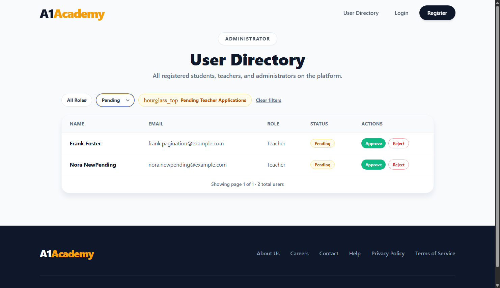
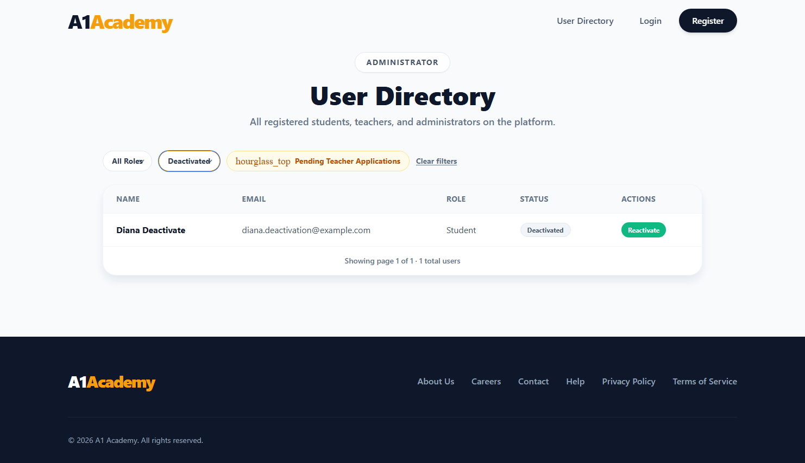
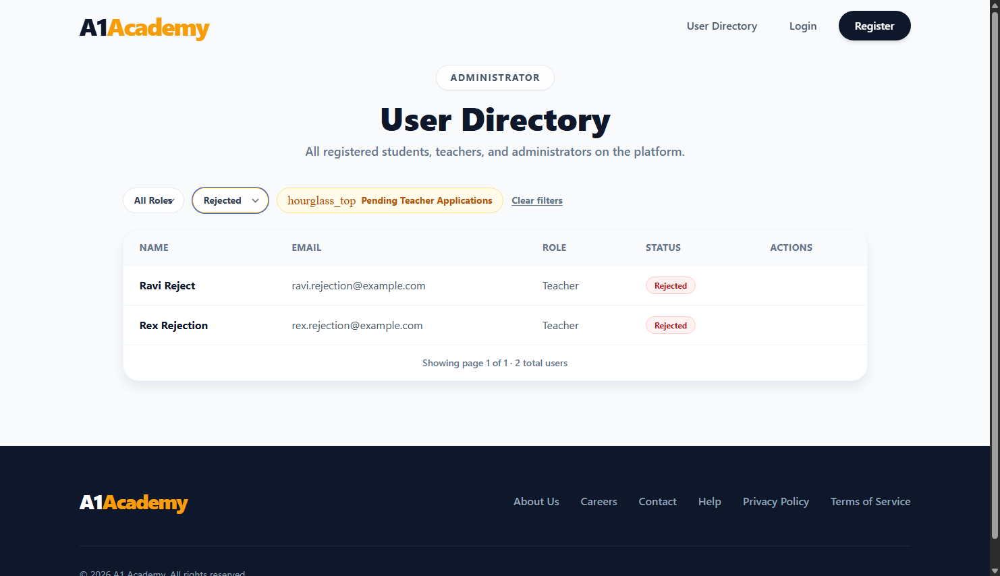

# Evidence — User Deactivation

**Story:** Cover approval state transitions and account deactivation rules.

## What changed

The old model only had a single `IsApproved` bool on `User`, which was enough for Pending vs
Active but had nowhere to put "rejected" or "deactivated". This ticket replaces it with a real
`AccountStatus` field (`Pending` / `Active` / `Rejected` / `Deactivated`) and a small state
machine that says exactly which moves are legal:

```
Pending -----approve----> Active <----reactivate----- Deactivated
   |                         |
 reject                  deactivate
   |                         |
   v                         v
Rejected                (back to Deactivated)
```

- **[AccountStatus.cs](../../backend/A1Academy.API/Data/Models/AccountStatus.cs)** - the four
  status constants.
- **[AccountStatusTransitions.cs](../../backend/A1Academy.API/Services/AccountStatusTransitions.cs)**
  - pure C#, no HTTP or database involved. `TryApply(action, currentStatus, ...)` is the single
  place that decides whether a move is legal, so every endpoint enforces identical rules.
- **[UsersController.cs](../../backend/A1Academy.API/Controllers/UsersController.cs)** - four thin
  endpoints (`PATCH /api/users/{id}/approve|reject|deactivate|reactivate`) that all funnel through
  the same `ApplyTransitionAsync` helper: look the user up (404 if missing), ask the state machine
  (400 with a plain-English reason if illegal), save and return the updated summary if legal.
  Deactivate/reactivate work on any role, not just Teachers. `GET /api/users?status=` now filters
  on the real `AccountStatus` column directly instead of a derived Role+bool expression.
- **[AuthController.cs](../../backend/A1Academy.API/Controllers/AuthController.cs)** - `Login`
  (and Google login) now reject anyone whose `AccountStatus` isn't `Active`, with a distinct
  message per status (Pending/Rejected/Deactivated) instead of one generic "not approved" line.
- **Migration `AddAccountStatus`** - adds the column, backfills it from the old `IsApproved` +
  `Role` values with a raw SQL `UPDATE` (not just a scaffolded default), then drops `IsApproved`.
  Applied to the local dev database and spot-checked before/after - see below.
- **Frontend** - the directory's Actions column now shows the right button(s) for whatever state
  a row is actually in: Approve *and* Reject on Pending, Deactivate on Active, Reactivate on
  Deactivated, nothing on Rejected (it's meant to be a dead end - a rejected applicant registers
  again rather than getting un-rejected). The Status filter dropdown also picks up Rejected and
  Deactivated as options.

## Automated test results

**Backend — 63/63 passed.**

- **17 new pure unit tests** in `AccountStatusTransitionsTests.cs` - every valid transition, and
  every invalid (action, status) pairing in the matrix (12 combinations), plus an unknown-action
  case. This is "tests cover invalid state transitions being rejected" proven exhaustively rather
  than with a couple of spot checks.
- **UsersEndpointTests.cs** grew from 25 to 27 tests covering the endpoints themselves: valid
  approve/reject transitions (including that a rejected teacher's login stays blocked), invalid
  transitions on each of the four actions (approving an Active or Rejected account, rejecting an
  Active account, deactivating a Pending or already-Deactivated account, reactivating an Active or
  Pending account), full deactivate→login-blocked and reactivate→login-unblocked round trips, and
  403 checks for each action as a non-Admin.
- **AuthControllerTest.cs** - added Rejected and Deactivated login-blocked cases (each asserting
  its specific message) alongside the existing Pending one, and a Register test confirming a new
  Teacher actually starts life as Pending.
- The specific edge case named on the ticket - approving an already-Active account - has its own
  test (`ApproveTeacher_AlreadyActive_ReturnsBadRequest`) confirming it's a 400, not a silent
  no-op, plus the mirror image for deactivate/reactivate.

**Frontend — 76/76 passed**, 5 new covering which action buttons render for which status,
clicking Reject/Deactivate/Reactivate hitting the right endpoint and updating the row, and an
action-specific error message on failure.

## Migration verified against real data

Before running the migration, the dev database had:

```
 Role    | IsApproved | count
Student  | true       | 18
Admin    | true       | 1
Teacher  | false      | 1
Teacher  | true       | 4
```

After `dotnet ef database update`:

```
 Role    | AccountStatus | count
Admin    | Active        | 1
Student  | Active        | 18
Teacher  | Active        | 4
Teacher  | Pending       | 1
```

Same counts, correctly mapped - the one previously-unapproved Teacher became the one Pending row,
everything else became Active.

## Live verification (real Postgres, real running app)

Registered real accounts through `/api/auth/register` (not seeded directly) to prove the whole
loop end to end, not just the database flag:

```
Teacher (Rex) registers -> AccountStatus = Pending
Login as Rex             -> 401 "Your account is pending administrator approval."
Admin rejects Rex        -> {"status":"Rejected"}
Login as Rex again       -> 401 "Your registration was not approved. Please contact support."

Deactivate Rex (already Rejected) -> 400 (invalid transition)

Student (Uma) registers  -> AccountStatus = Active
Login as Uma              -> 200 (token issued)
Admin deactivates Uma      -> {"status":"Deactivated"}
Login as Uma again         -> 401 "Your account has been deactivated. Please contact support."
Admin reactivates Uma       -> {"status":"Active"}
Login as Uma once more       -> 200 (token issued again)
```

Invalid-transition edge cases, also checked live:

| Action | Starting status | Result |
|---|---|---|
| Approve | Active (already approved) | 400 |
| Approve | Rejected | 400 |
| Reject | Rejected (already rejected) | 400 |
| Deactivate | Pending | 400 |
| Deactivate | Rejected | 400 |
| Reactivate | Active (never deactivated) | 400 |

Then drove a real headless Brave session through the actual directory UI, filtering by each
status to see the right buttons on real rows:

Pending - Approve and Reject side by side:


Deactivated - Reactivate:


Rejected - no action button, by design:


## How to reproduce

```bash
docker-compose up -d postgres kafka zookeeper
cd backend/A1Academy.API && dotnet ef database update && dotnet run
npm run dev --prefix frontend

cd backend/A1Academy.Tests && dotnet test --filter "Category!=E2E"
cd frontend && npx vitest run
```
